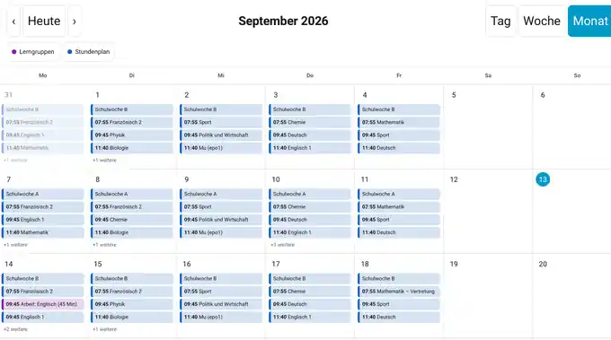

# SPH Kalender

Kartentyp: `custom:sph-kalender-card`

## Funktion

Die Karte zeigt die von SPH-HA bereitgestellten Home-Assistant-Kalender in Tag-, Wochen- oder Monatsansicht. Sie verwendet Home Assistants `calendar/event/subscribe` und erhält Terminänderungen live über WebSocket.

Unterstützt werden:

- Ganztagstermine
- zeitgebundene Termine
- mehrtägige Termine
- überlappende Termine
- mehrere SPH-Kalenderquellen
- lokale eigene Termine
- Filter und Quellfarben

## Screenshots

### Tagesansicht


### Wochenansicht


### Monatsansicht



## Vertretungen im Stundenplan-Kalender

Unterrichtstermine des nativen `calendar.stundenplan_*` werden serverseitig mit dem internen SPH-Vertretungsplan abgeglichen.

Dabei können Kalendertermine unter anderem enthalten beziehungsweise widerspiegeln:

- Entfall/Ausfall
- Vertretungsart
- Fachwechsel
- ursprüngliches Fach
- Vertretungslehrkraft
- Raumänderung

Die UID des regulären Unterrichtstermins bleibt stabil. Eine Vertretung erzeugt daher keinen zusätzlichen unabhängigen Stundenplaneintrag.

Das aktive serverseitige Schul-Profil kann die daraus erzeugten Fach-, Lehrer- und Vertretungsbezeichnungen weiter schulspezifisch aufbereiten.

## Automatische Kalenderauswahl

Ohne `calendars:` gilt:

1. Existiert ein `calendar.sph_*`, wird der zusammengefasste SPH-Kalender verwendet.
2. Andernfalls werden verfügbare `calendar.schulkalender_*`, `calendar.stundenplan_*` und `calendar.lerngruppen_*` verwendet.
3. `calendar.bewegliche_ferientage_*` wird nicht automatisch eingeblendet.

Bei mehreren Kindern kann `child` die Suche eingrenzen.

## Schul-Profile

Die Karte erkennt das zum Kind gehörende Profil automatisch über die SPH-Sensoren. Serverseitige Profilanpassungen sind bereits in den Kalenderdaten enthalten; das optionale Frontend-Profil kann zusätzlich reine Darstellungsdetails wie beschriftete Lehrerzeilen anpassen.

Für Tests oder einen gezielten Override kann `school-profile` gesetzt werden:

```yaml
type: custom:sph-kalender-card
view: week
child: mk
school-profile: kfg
```

Mit `school-profile: false` kann die Profil-Darstellung der Karte deaktiviert werden.

Allgemeine Dokumentation: [Schul-Profile](../SCHOOL_PROFILES.md).

## Konfiguration

| Parameter | Typ | Standard | Beschreibung |
|---|---|---|---|
| `type` | String | erforderlich | `custom:sph-kalender-card` |
| `title` | String | `SPH Kalender` | Kartentitel |
| `view` | `day`, `week`, `month` | `week` | Startansicht |
| `date` | `YYYY-MM-DD` | heute | Navigationsdatum |
| `locale` | String | `de-DE` | Datums-/Zeitformat |
| `child` | String | leer | Kind/Kürzel für automatische Auswahl |
| `calendars` | Liste | automatisch | Explizite Kalenderquellen |
| `filters` | Objekt | leer | YAML-Filter |
| `colors` | Objekt | Standardfarben | Farben pro Quelle |
| `start_hour` | Zahl | `7`/automatisch | Frühester sichtbarer Stundenwert |
| `end_hour` | Zahl | `18`/automatisch | Letzter sichtbarer Stundenwert |
| `hour_height` | Zahl | `52` | Pixelhöhe pro Stunde |
| `month_max_events` | Zahl | `4` | Direkt sichtbare Termine pro Tag im Monat |
| `school-profile` | String/false | automatisch | Expliziter Schul-Profil-Override für die Darstellung |

## Minimalbeispiel

```yaml
type: custom:sph-kalender-card
view: week
child: mk
```

## Explizite Kalenderquellen

```yaml
type: custom:sph-kalender-card
view: week
calendars:
  - entity: calendar.schulkalender_maxim_mk
    name: Schulkalender
    source: schulkalender
  - entity: calendar.stundenplan_maxim_mk
    name: Stundenplan
    source: stundenplan
  - entity: calendar.lerngruppen_maxim_mk
    name: Lerngruppen
    source: lerngruppen
```

Kurzform:

```yaml
calendars:
  - calendar.schulkalender_maxim_mk
  - calendar.stundenplan_maxim_mk
```

## Filter

```yaml
filters:
  calendars:
    - stundenplan
    - lerngruppen
    - schulkalender
    - manuell
  exclude:
    - Schulwoche
```

Unterstützt werden:

- `calendars` / `include_calendars`
- `exclude_calendars`
- `include`
- `exclude`

Textvergleiche erfolgen ohne Beachtung der Groß-/Kleinschreibung.

## Eigene Termine

Wenn die ausgewählte SPH-Kalenderquelle `CREATE_EVENT` und `DELETE_EVENT` unterstützt, zeigt die Karte `+ Termin` an.

Lokale Termine können Titel, Start/Ende, Ganztag, Ort und Beschreibung enthalten. Nur lokal angelegte SPH-Termine sind löschbar. Wiederholungsregeln werden derzeit nicht unterstützt.

## Hinweise

- Navigation in der Karte verändert nur die lokale Kartenansicht.
- Die Monatsansicht zeigt vollständige Montag-bis-Sonntag-Wochen.
- Sichtbare Quellen können zusätzlich über interaktive Filter-Chips ein-/ausgeblendet werden.
