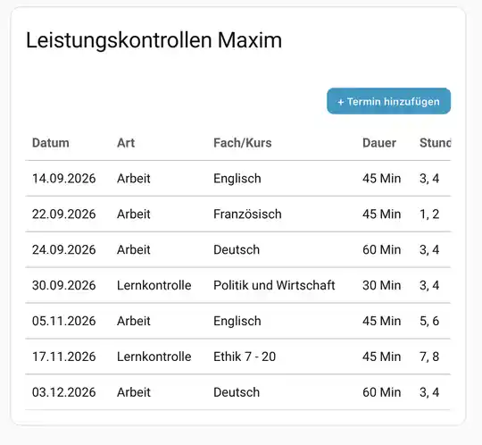

# SPH Lerngruppen

Kartentyp: `custom:sph-lerngruppen-card`

## Funktion

Die Karte zeigt Leistungskontrollen aus dem SPH-Lerngruppen-Modul. Angezeigt werden Datum, Art, Fach/Kurs, Dauer, Schulstunden, Lehrkraft und Quelle.

Neben SPH-Daten können lokale Termine angelegt werden. Nur lokal erstellte Termine sind über die Karte löschbar.

## Fach- und Kursbezeichnungen

Für Lerngruppen wird dieselbe zentrale Fachnormalisierung wie bei **Mein Unterricht** verwendet. Klassenkennungen und technische Kurskennungen werden für die sichtbare Fachbezeichnung entfernt, beispielsweise:

- `Deutsch 7n` → `Deutsch`
- `D 05cG` → `Deutsch`
- `Englisch 7n (E2vd)` → `Englisch`

Der Sensor stellt dafür je Leistungskontrolle zusätzlich `fach` bereit. `kurs` bleibt als konkrete Kursbezeichnung verfügbar. Die Karte zeigt bevorzugt `fach` und verwendet `kurs` nur als Rückfallwert für ältere oder unvollständige Datensätze.

Auch die Zusammenfassung des Lerngruppen-Kalenders verwendet die normalisierte Fachbezeichnung.

## Screenshot



## Zeitzuordnung

Schulstunden wie `3`, `3,4` oder `3-4` werden im Backend normalisiert. Wenn der persönliche Stundenplan für diese Stunden Zeiten enthält, erzeugt das Modul zeitgebundene Kalendertermine; andernfalls bleibt der Termin ganztägig.

## Schul-Profile

Das pro Kind ausgewählte Schul-Profil wird serverseitig auf Sensor-, JSON- und Kalenderdaten angewandt. Dadurch können beispielsweise schulspezifische Fach- oder Lehrernamen direkt in den veröffentlichten Daten erscheinen.

Die Karte erkennt das Profil zusätzlich über `school_profile`. Für Tests oder einen gezielten Darstellungs-Override kann verwendet werden:

```yaml
type: custom:sph-lerngruppen-card
entity: sensor.lerngruppen_maxim_mk
school-profile: kfg
```

Mit `school-profile: false` kann die Profil-Darstellung einer einzelnen Karte deaktiviert werden.

Allgemein: [Schul-Profile](../SCHOOL_PROFILES.md).

## Entity-Auswahl

1. `entity` oder `sensor`.
2. Bei `child`: passender `sensor.lerngruppen_*` über `kind_kürzel`.
3. Sonst erster passender strukturierter Lerngruppen-Sensor.

JSON-Sensoren mit `_json` werden nicht als Kartenquelle verwendet.

## Konfiguration

| Parameter | Typ | Standard | Beschreibung |
|---|---|---|---|
| `type` | String | erforderlich | `custom:sph-lerngruppen-card` |
| `title` | String | `Lerngruppen – Leistungskontrollen` | Kartentitel |
| `entity` | Entity-ID | automatisch | Strukturierter Lerngruppen-Sensor |
| `sensor` | Entity-ID | automatisch | Alias |
| `child` | String | leer | Kind/Kürzel |
| `school-profile` | String/false | automatisch | Expliziter Schul-Profil-Override |

## Eigene Termine

`+ Termin hinzufügen` öffnet einen Dialog für:

- Datum
- Art
- Fach/Kurs
- optionale Dauer in Minuten
- optionale Schulstunden
- optionale Lehrkraft

Services:

```text
sph.lerngruppen_termin_hinzufuegen
sph.lerngruppen_termin_loeschen
```

Lokale Termine werden persistent gespeichert und mit SPH-Terminen zusammengeführt. Ein passender SPH-Termin kann einen lokalen Eintrag in der Anzeige verdrängen, ohne den lokalen Datensatz zu löschen.

## Hinweise

- Importierte SPH-Termine sind schreibgeschützt.
- Die Tabelle ist horizontal scrollbar.
- Dialogzustand, Eingabewerte, Fokus und Scrollposition werden bei Sensorupdates möglichst erhalten.
