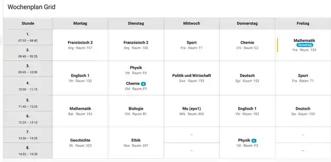
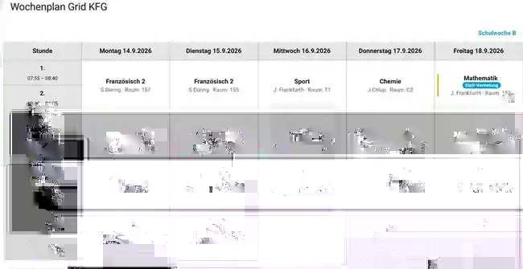

# SPH Stundenplan Raster

Kartentyp: `custom:sph-stundenplan-grid-card`

## Funktion

Die Karte zeigt den persönlichen Wochenstundenplan Montag bis Freitag als Tabellenraster. Zeilen entsprechen Schulstunden, Spalten den Wochentagen. Doppelstunden bzw. längere Blöcke werden über mehrere Stundenzeilen zusammengefasst.

Mindestens acht Stundenzeilen werden dargestellt; bei späteren Stunden erweitert sich das Raster automatisch.

Angezeigt werden:

- Schulstunde und Uhrzeit
- Fach
- Lehrkraft
- Raum
- Badges
- Arbeiten/Klausuren aus dem Schulkalender
- Vertretungsinformationen

## Screenshots

### Allgemeine Rasteransicht



### Beispiel mit KFG School Hack



## Vertretungen

Ohne School Hack verwendet die Karte automatisch den internen SPH-Vertretungsplan des Kindes.

Entfall, Vertretung, Fachwechsel, Raumänderung und Vertretungslehrkraft werden direkt in der jeweiligen Tabellenzelle dargestellt.

Mit `school-hacks: <profil>` wird zuerst die schulische Profilquelle verwendet. Der interne SPH-Vertretungsplan dient als Fallback für Stunden ohne Treffer in der bevorzugten Quelle.

Eine explizit konfigurierte Vertretungsquelle bleibt autoritativ.

## School Hacks

```yaml
type: custom:sph-stundenplan-grid-card
entity: sensor.stundenplan_maxim_mk
school-hacks: kfg
```

Allgemein: [School Hacks](school-hacks.md).

KFG: [Kaiserin-Friedrich-Gymnasium Bad Homburg](../schools/kfg/README.md).

## Entity-Auswahl

1. `entity` oder `sensor`.
2. `child` über `kind_kürzel`.
3. automatische Stundenplan-Suche.

## Konfiguration

| Parameter | Typ | Standard | Beschreibung |
|---|---|---|---|
| `type` | String | erforderlich | `custom:sph-stundenplan-grid-card` |
| `title` | String | leer | Kartentitel |
| `entity` | Entity-ID | automatisch | Stundenplan-Sensor |
| `sensor` | Entity-ID | automatisch | Alias |
| `child` | String | leer | Kind/Kürzel |
| `school-hacks` | String/false | false | Optionales Schulprofil |
| `vertretungsplan_sensor` | Entity-ID | automatisch | Explizite Vertretungsquelle |
| `vertretungsplan` | Entity-ID | automatisch | Alias |
| `substitution_sensor` | Entity-ID | automatisch | Alias |

## Beispiel

```yaml
type: custom:sph-stundenplan-grid-card
entity: sensor.stundenplan_maxim_mk
title: Wochenstundenplan
```

## Sections-Dashboard

Die Karte meldet Home Assistant eine Darstellung in voller Breite mit mindestens 12 Spalten. Auf schmalen Displays bleibt das Raster horizontal scrollbar.

## Hinweise

- Die Ansicht umfasst Montag bis Freitag.
- Kalender-Markierungen beziehen sich auf Arbeiten und Klausuren.
- Die Karte verändert keine Stundenplan-, Vertretungs- oder Kalendereinträge.
- School-Hack-spezifische Wochenüberschriften und Badge-Regeln werden ausschließlich vom Profil gesteuert.
