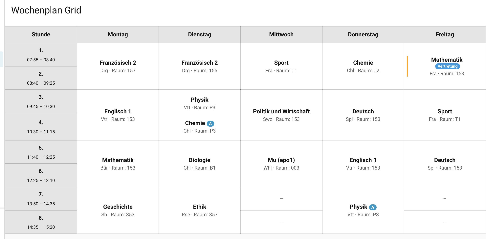
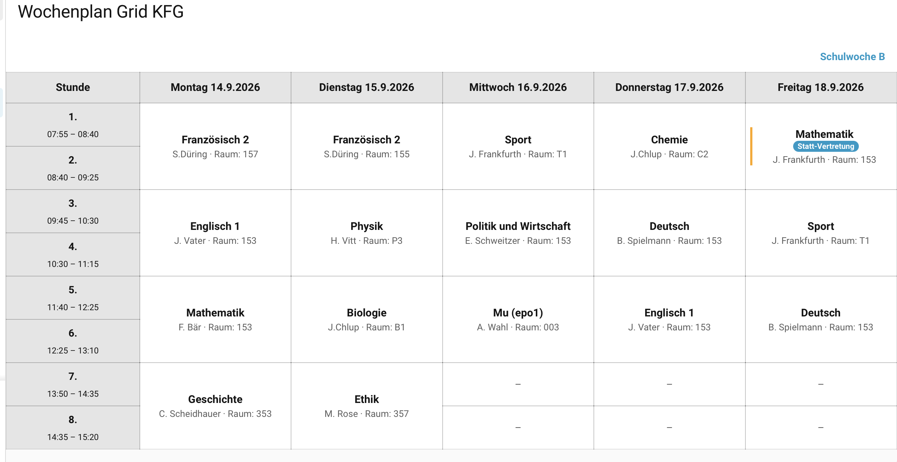

# SPH Stundenplan Raster

Kartentyp: `custom:sph-stundenplan-grid-card`

## Funktion

Die Karte zeigt den persönlichen Wochenstundenplan Montag bis Freitag als Tabellenraster. Zeilen entsprechen Schulstunden, Spalten den Wochentagen. Doppelstunden bzw. längere Blöcke werden über mehrere Stundenzeilen zusammengefasst.

Mindestens acht Stundenzeilen werden dargestellt; bei späteren Stunden erweitert sich das Raster automatisch.

Angezeigt werden:

- Schulstunde und Uhrzeit
- Fach
- Lehrkraft
- Raum
- Badges
- Arbeiten/Klausuren aus dem Schulkalender
- Vertretungsinformationen

## Screenshots

### Allgemeine Rasteransicht



### Beispiel mit KFG-Schulprofil



## Vertretungen

Die Karte verwendet automatisch den internen SPH-Vertretungsplan des Kindes. Ein aktives Schul-Profil kann zusätzlich eine bevorzugte Vertretungsquelle definieren.

Entfall, Vertretung, Fachwechsel, Raumänderung und Vertretungslehrkraft werden direkt in der jeweiligen Tabellenzelle dargestellt.

Die Quellen-Priorität lautet:

1. explizite Kartenquelle über `vertretungsplan_sensor`, `vertretungsplan` oder `substitution_sensor`,
2. bevorzugte Quelle des aktiven Schul-Profils,
3. interner SPH-Vertretungsplan als Fallback.

Eine explizit konfigurierte Vertretungsquelle bleibt autoritativ.

## Schul-Profile

Das im Integrationseintrag ausgewählte Profil wird über das Sensorattribut `school_profile` automatisch erkannt.

Für Tests oder einen gezielten Override:

```yaml
type: custom:sph-stundenplan-grid-card
entity: sensor.stundenplan_maxim_mk
school-profile: kfg
```

Mit `school-profile: false` kann die Profil-Darstellung für eine einzelne Karte deaktiviert werden.

Allgemein: [Schul-Profile](../SCHOOL_PROFILES.md).

KFG: [Kaiserin-Friedrich-Gymnasium Bad Homburg](../schools/kfg/README.md).

## Entity-Auswahl

1. `entity` oder `sensor`.
2. `child` über `kind_kürzel`.
3. automatische Stundenplan-Suche.

## Konfiguration

| Parameter | Typ | Standard | Beschreibung |
|---|---|---|---|
| `type` | String | erforderlich | `custom:sph-stundenplan-grid-card` |
| `title` | String | leer | Kartentitel |
| `entity` | Entity-ID | automatisch | Stundenplan-Sensor |
| `sensor` | Entity-ID | automatisch | Alias |
| `child` | String | leer | Kind/Kürzel |
| `school-profile` | String/false | automatisch | Expliziter Schul-Profil-Override |
| `vertretungsplan_sensor` | Entity-ID | automatisch | Explizite Vertretungsquelle |
| `vertretungsplan` | Entity-ID | automatisch | Alias |
| `substitution_sensor` | Entity-ID | automatisch | Alias |

## Beispiel

```yaml
type: custom:sph-stundenplan-grid-card
entity: sensor.stundenplan_maxim_mk
title: Wochenstundenplan
```

## Sections-Dashboard

Die Karte meldet Home Assistant eine Darstellung in voller Breite mit mindestens 12 Spalten. Auf schmalen Displays bleibt das Raster horizontal scrollbar.

## Hinweise

- Die Ansicht umfasst Montag bis Freitag.
- Kalender-Markierungen beziehen sich auf Arbeiten und Klausuren.
- Die Karte verändert keine Stundenplan-, Vertretungs- oder Kalendereinträge.
- Profil-spezifische Wochenüberschriften und Badge-Regeln werden vom aktiven Frontend-Profil gesteuert.
