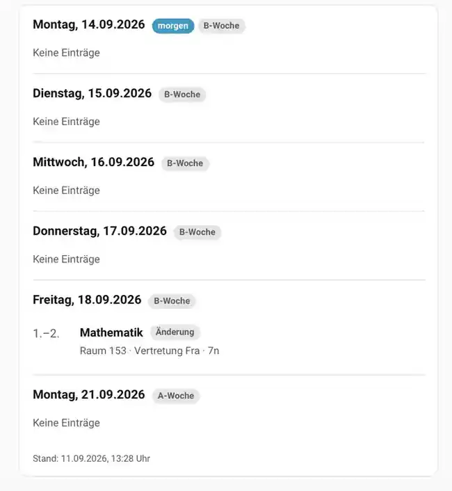

# SPH Vertretungsplan

Kartentyp: `custom:sph-vertretungsplan-card`

Die Karte zeigt veröffentlichte Vertretungsplantage aus dem internen SPH-Vertretungsplan-Modul.

## Darstellung

Angezeigt werden je nach Datenlage:

- Datum und Wochentag
- Schulstunde/Stundenbereich
- Fach
- ursprüngliches Fach
- Vertretungsart
- Vertretungslehrkraft
- Raum bzw. Raumänderung
- Hinweise
- Entfall/Ausfall

Entfälle werden hervorgehoben und als Ausfall gekennzeichnet. Raumänderungen können den bisherigen Raum zusätzlich darstellen.

## Screenshot



## Beispiel

```yaml
type: custom:sph-vertretungsplan-card
entity: sensor.vertretungsplan_maxim_mk
title: Vertretungsplan Maxim
```

Alternativ:

```yaml
type: custom:sph-vertretungsplan-card
child: mk
```

## Optionen

| Option | Standard | Wirkung |
|---|---|---|
| `entity` / `sensor` | automatisch | Expliziter strukturierter Vertretungsplan-Sensor |
| `child` | leer | Kindname oder Kürzel für automatische Sensorwahl |
| `title` | leer | Kartenüberschrift |
| `days` | alle | Maximale Anzahl dargestellter Tage |
| `hide_empty` | `false` | Tage ohne Einträge ausblenden |
| `only_cancellations` | `false` | Nur als Entfall erkannte Einträge anzeigen |

JSON-Sensoren werden nicht als Kartenquelle verwendet.

## Sensor-Payload

Der strukturierte Sensor enthält unter anderem:

- `school_profile`
- `tage`
- `heute`
- `morgen`
- `anzahl_heute`
- `anzahl_morgen`
- `entfaelle_heute`
- `entfaelle_morgen`
- `hinweise`
- `aktualisiert`
- `wird_aktualisiert`

Ein Eintrag kann unter anderem enthalten:

- `datum`
- `stunde`
- `stunden`
- `von_stunde`
- `bis_stunde`
- `klasse`
- `fach`
- `fach_alt`
- `vertreter`
- `lehrer`
- `art`
- `art_lang`
- `raum`
- `hinweis`
- `entfall`

`art` enthält den Rohwert des Portals, `art_lang` die lesbare Bezeichnung. Das aktive Schul-Profil kann `art_lang`, Lehrer- und Fachwerte schulspezifisch aufbereiten.

## JSON-Sensor

Zusätzlich wird erzeugt:

```text
sensor.vertretungsplan_maxim_mk_json
```

Das Attribut `json` enthält denselben vollständigen logischen und profilierten Payload in kompaktem JSON. Dieser Sensor ist besonders für ESPHome, Displays und andere Clients geeignet, die einfacher mit einem JSON-Block arbeiten können.

## Entfall-Binärsensoren

```text
binary_sensor.erste_stunde_entfaellt_heute_maxim_mk
binary_sensor.erste_stunde_entfaellt_morgen_maxim_mk
```

Die tatsächlich geprüfte Bezugsstunde wird in den Integrationsoptionen festgelegt und kann unabhängig vom Entity-Namen gewählt werden.

Wenn für den jeweiligen Tag noch kein Vertretungsplan veröffentlicht wurde, ist der Sensor `unavailable` statt `off`.

## Verwendung durch andere SPH-Funktionen

Der interne Vertretungsplan wird auch verwendet von:

- den `sph-stundenplan-*` Karten,
- dem nativen Stundenplan-Kalender,
- dem zusammengefassten SPH-Kalender über dessen Stundenplanquelle.

In Stundenplankarten kann ein aktives Schul-Profil eine bevorzugte Vertretungsquelle definieren. Fehlt dort ein passender Eintrag, dient der interne SPH-Vertretungsplan als Fallback. Eine explizit in der Karte konfigurierte Vertretungsquelle bleibt autoritativ.

Native Kalender verwenden die serverseitigen SPH-Daten und die serverseitigen Schul-Profil-Hooks.
